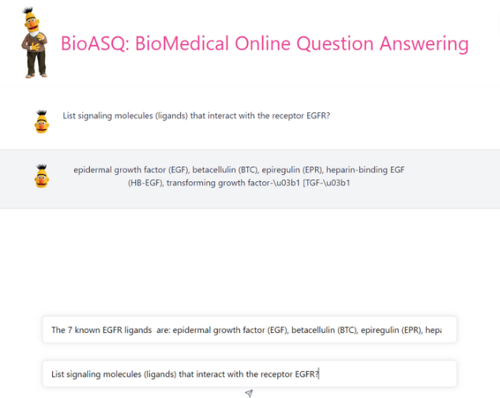

# BioMedical Question Answering

這是一個部屬生物醫學問答 AI 的方法\

## Training process

這個專案大部分的概念我都是參考 https://github.com/EmilyNLP/BioMedical-Question-Answering 這個博主的方法

主要的流程跟博主的方法基本一致，資料也大部分相同

1. 用 PubMed Pretrained 
2. 用 MLM 方法 Pretrained backbone
3. 將 MLM 頭部換成 QA 頭部並在 SQuAD 和 BioASQ 資料上 Fine-tune

### PubMed

The main procedure to access PubMed corpous is the following:
- Go to the website https://ftp.ncbi.nlm.nih.gov/pubmed/baseline/
- download all the .gz .md5 file
- preprocess to .txt file
- The txt file is about 740 MB, therefore, we only use part of the articles

Another way to access the medical article is through FTP connection

### Pretrained MLM

以下是 Pretrained MLM 的細部參數

- Number of tokens: 50265
- Epochs:  1
- Num examples: 79974
- Batch size: 4
- Learning rate: 5e-5
- Optimizer: AdamW
- Block size: 512
- Loss function: CE with mask tokens only
- Scheduler: Linear Warmup Scheduler

### Fine-tune on BioASQ

以下是 Fine-tune on BioASQ 的細部參數

- Number of tokens: 2 (start, end)
- Epochs:  1
- Num examples: 88707、3025
- Batch size: 4
- Learning rate: 5e-5
- Optimizer: AdamW
- Block size: 512
- Loss function: CE with mask tokens only
- Scheduler: Linear Warmup Scheduler
- Max sequence length: 384
- Document stride: 128
- Max query length: 64

## Frontend framework

對於前端架構，我使用的是 ReactJS + TailwindCSS，網站排版是參照 ChatGPT 的網頁 (https://chat.openai.com/chat)

## Backend framework

對於後端架構，為了引入 AI 模型，我使用的是 python 的 Django 系統，並加上 RESTful API 與 backend 的版本控制

## Development

最後我們在部屬在 Docker 上，用法如下

```
docker build -t aihub
docker run -p 8000:8000 aihub
```

